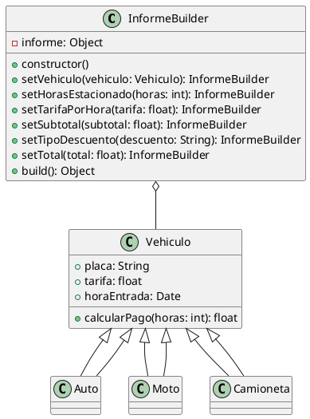

# Patrón Builder en el Proyecto de Parqueadero

## Introducción

El patrón Builder es un patrón de diseño creacional que permite construir objetos complejos paso a paso. Este patrón es útil cuando la creación de un objeto implica varios pasos o configuraciones, y se desea evitar un constructor con muchos parámetros.

## Implementación del Patrón Builder

### Problema

La creación de un informe detallado de los vehículos estacionados implica varios pasos y configuraciones. Usar un constructor con muchos parámetros puede hacer que el código sea difícil de leer y mantener.

### Cómo lo Soluciona

El patrón Builder permite construir el informe paso a paso, configurando cada parte del informe de manera flexible y reutilizable. Esto mejora la legibilidad y mantenibilidad del código.


## Estructura del Código

### Clase `InformeBuilder`

La clase `InformeBuilder` se utiliza para construir un informe detallado de los vehículos estacionados. Esta clase permite configurar diferentes partes del informe de manera flexible y paso a paso.

```javascript
class InformeBuilder {
  constructor() {
    this.informe = {};
  }

  setVehiculo(vehiculo) {
    this.informe.vehiculo = {
      tipo: vehiculo.constructor.name,
      placa: vehiculo.placa
    };
    return this;
  }

  setHorasEstacionado(horas) {
    this.informe.horasEstacionado = horas;
    return this;
  }

  setTarifaPorHora(tarifa) {
    this.informe.tarifaPorHora = tarifa;
    return this;
  }

  setSubtotal(subtotal) {
    this.informe.subtotal = subtotal;
    return this;
  }

  setTipoDescuento(descuento) {
    this.informe.tipoDescuento = descuento;
    return this;
  }

  setTotal(total) {
    this.informe.total = total;
    return this;
  }

  build() {
    return this.informe;
  }
}

module.exports = InformeBuilder;
```

### Diagrama de Clases



### Explicación del Código

#### Constructor

El constructor de la clase `InformeBuilder` inicializa el objeto informe como un objeto vacío. Este objeto se irá construyendo paso a paso mediante los métodos de la clase.

```javascript
constructor() {
  this.informe = {};
}
```

#### Método `setVehiculo`

El método `setVehiculo` configura el vehículo en el informe. Recibe un objeto `vehiculo` y extrae su tipo y placa para añadirlos al informe.

```javascript
setVehiculo(vehiculo) {
  this.informe.vehiculo = {
    tipo: vehiculo.constructor.name,
    placa: vehiculo.placa
  };
  return this;
}
```

#### Método `setHorasEstacionado`

El método `setHorasEstacionado` configura las horas estacionado en el informe. Recibe un número de horas y lo añade al informe.

```javascript
setHorasEstacionado(horas) {
  this.informe.horasEstacionado = horas;
  return this;
}
```

#### Método `setTarifaPorHora`

El método `setTarifaPorHora` configura la tarifa por hora en el informe. Recibe una tarifa y la añade al informe.

```javascript
setTarifaPorHora(tarifa) {
  this.informe.tarifaPorHora = tarifa;
  return this;
}
```

#### Método `setSubtotal`

El método `setSubtotal` configura el subtotal en el informe. Recibe un subtotal y lo añade al informe.

```javascript
setSubtotal(subtotal) {
  this.informe.subtotal = subtotal;
  return this;
}
```

#### Método `setTipoDescuento`

El método `setTipoDescuento` configura el tipo de descuento en el informe. Recibe un tipo de descuento y lo añade al informe.

```javascript
setTipoDescuento(descuento) {
  this.informe.tipoDescuento = descuento;
  return this;
}
```

#### Método `setTotal`

El método `setTotal` configura el total en el informe. Recibe un total y lo añade al informe.

```javascript
setTotal(total) {
  this.informe.total = total;
  return this;
}
```

#### Método `build`

El método `build` devuelve el objeto informe construido. Este método se llama al final del proceso de construcción para obtener el informe completo.

```javascript
build() {
  return this.informe;
}
```

## Uso del Patrón Builder en el Proyecto

En el proyecto de parqueadero, el patrón Builder se utiliza para construir informes detallados de los vehículos estacionados. Esto permite configurar diferentes partes del informe de manera flexible y paso a paso.

### Ejemplo de Uso

```javascript
const InformeBuilder = require('./patterns/builder/informeBuilder');
const VehiculoFactory = require('./patterns/factory/vehiculoFactory');

// Crear una instancia de un vehículo
const vehiculo = VehiculoFactory.createVehiculo('auto', 'ABC123');

// Construir un informe
const informeBuilder = new InformeBuilder();
const informe = informeBuilder
  .setVehiculo(vehiculo)
  .setHorasEstacionado(3)
  .setTarifaPorHora(vehiculo.tarifa)
  .setSubtotal(vehiculo.calcularPago(3))
  .setTipoDescuento('ninguno')
  .setTotal(vehiculo.calcularPago(3))
  .build();

console.log(informe);
```

## Conclusión

El patrón Builder es una solución efectiva para construir objetos complejos paso a paso en el proyecto de parqueadero. Proporciona una forma flexible y reutilizable de configurar diferentes partes del informe de los vehículos estacionados.