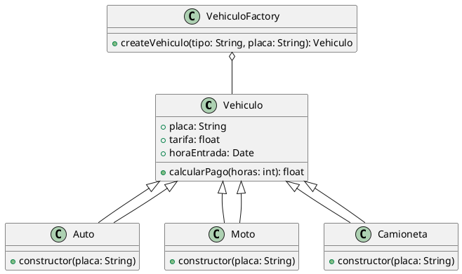

## Documentación del Patrón Factory

El patrón Factory es un patrón de diseño creacional que proporciona una interfaz para crear objetos en una superclase, pero permite a las subclases alterar el tipo de objetos que se crearán. Este patrón es útil cuando el proceso de creación de objetos es complejo o requiere una lógica adicional que no debería estar en el constructor de la clase.

## Implementación del Patrón Factory

### Problema

La creación de diferentes tipos de vehículos (`Auto`, `Moto`, `Camioneta`) puede implicar lógica adicional y compleja que no debería estar en el constructor de la clase.

### Cómo lo Soluciona

El patrón Factory proporciona una interfaz para crear objetos en una superclase, pero permite a las subclases alterar el tipo de objetos que se crearán. Esto centraliza la lógica de creación y mejora la mantenibilidad del código.

### Diagrama de Clases



### Estructura del Código

#### Clase Vehiculo
La clase Vehiculo es la superclase que define los atributos y métodos comunes a todos los tipos de vehículos.

```js
class Vehiculo {
  constructor(placa, tarifa) {
    this.placa = placa;
    this.tarifa = tarifa;
    this.horaEntrada = new Date().toISOString();
  }

  calcularPago(horas) {
    return horas * this.tarifa;
  }
}
```

#### Subclases Auto, Moto, Camioneta
Las subclases Auto, Moto y Camioneta heredan de la clase Vehiculo y definen tarifas específicas para cada tipo de vehículo.

```js
class Auto extends Vehiculo {
  constructor(placa) {
    super(placa, 5000);  // Auto paga 5000 por hora
  }
}

class Moto extends Vehiculo {
  constructor(placa) {
    super(placa, 2000);  // Moto paga 2000 por hora
  }
}

class Camioneta extends Vehiculo {
  constructor(placa) {
    super(placa, 7000);  // Camioneta paga 7000 por hora
  }
}
```

#### Clase VehiculoFactory
La clase VehiculoFactory proporciona un método para crear objetos de tipo Vehiculo basados en el tipo de vehículo especificado.

```js
class VehiculoFactory {
  createVehiculo(tipo, placa) {
    switch (tipo) {
      case 'auto':
        return new Auto(placa);
      case 'moto':
        return new Moto(placa);
      case 'camioneta':
        return new Camioneta(placa);
      default:
        throw new Error("Tipo de vehículo no válido.");
    }
  }
}

module.exports = new VehiculoFactory();
```

### Explicación del Código

#### Clase Vehiculo
La clase Vehiculo define los atributos comunes a todos los vehículos, como la placa, la tarifa y la hora de entrada. También define el método calcularPago, que calcula el costo del estacionamiento basado en las horas estacionadas.

#### Subclases Auto, Moto, Camioneta
Las subclases Auto, Moto y Camioneta heredan de la clase Vehiculo y definen tarifas específicas para cada tipo de vehículo. Cada subclase llama al constructor de la superclase Vehiculo con la placa y la tarifa correspondiente.

#### Clase VehiculoFactory
La clase VehiculoFactory proporciona un método createVehiculo que toma como parámetros el tipo de vehículo y la placa, y devuelve una instancia de la subclase correspondiente (Auto, Moto o Camioneta). Si el tipo de vehículo no es válido, lanza un error.

### Uso del Patrón Factory en el Proyecto
En el proyecto de parqueadero, el patrón Factory se utiliza para crear instancias de diferentes tipos de vehículos (Auto, Moto, Camioneta) de manera flexible y centralizada. Esto permite agregar nuevos tipos de vehículos fácilmente sin modificar el código existente.

### Ejemplo de Uso
```javascript
const vehiculoFactory = require('./VehiculoFactory');

const auto = vehiculoFactory.createVehiculo('auto', 'ABC123');
const moto = vehiculoFactory.createVehiculo('moto', 'XYZ789');
const camioneta = vehiculoFactory.createVehiculo('camioneta', 'LMN456');

console.log(auto);
console.log(moto);
console.log(camioneta);
```

### Conclusión
El patrón Factory es una solución efectiva para gestionar la creación de objetos en el proyecto de parqueadero. Proporciona una interfaz flexible y centralizada para crear instancias de diferentes tipos de vehículos, mejorando la mantenibilidad y extensibilidad del sistema.