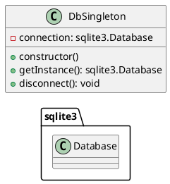

# Documentación del Patrón Singleton en `dbSingleton.js`

## Diagrama de Clases



## Explicación del Código

### Constructor

El constructor de la clase `DbSingleton` se asegura de que solo haya una instancia de la conexión a la base de datos. Si no existe una instancia previa, se crea una nueva conexión a la base de datos SQLite.

```javascript
class DbSingleton {
        constructor() {
                if (!DbSingleton.instance) {
                        this.connection = new sqlite3.Database('parqueadero.db', (err) => {
                                if (err) {
                                        console.error('Error al conectar a la base de datos:', err.message);
                                } else {
                                        console.log('Conectado a la base de datos SQLite.');
                                }
                        });
                        DbSingleton.instance = this;
                }
                return DbSingleton.instance;
        }
}
```

### Método `getInstance`

El método `getInstance` devuelve la instancia de la conexión a la base de datos. Este método proporciona un punto de acceso global a la instancia única de la base de datos.

```javascript
getInstance() {
        return this.connection;
}
```

### Método `disconnect`

El método `disconnect` cierra la conexión a la base de datos si existe una conexión activa. Este método es útil para liberar recursos cuando la conexión a la base de datos ya no es necesaria.

```javascript
disconnect() {
        if (this.connection) {
                this.connection.close((err) => {
                        if (err) {
                                console.error('Error al desconectar la base de datos:', err.message);
                        } else {
                                console.log('Desconectado de la base de datos SQLite.');
                        }
                });
                this.connection = null;
        }
}
```

## Uso del Patrón Singleton en el Proyecto

En el proyecto de parqueadero, el patrón Singleton se utiliza para gestionar la conexión a la base de datos SQLite. Esto garantiza que solo haya una única conexión a la base de datos en todo momento, lo que ayuda a evitar problemas de concurrencia y a mejorar el rendimiento.

## Ejemplo de Uso

En `app2.js`, se utiliza la instancia única de la base de datos para realizar operaciones como la creación de tablas, inserción de datos y consultas.

```javascript
const dbInstance = require('./patterns/singleton/dbSingleton').getInstance();

dbInstance.run(`CREATE TABLE IF NOT EXISTS parqueos (
        id INTEGER PRIMARY KEY AUTOINCREMENT, 
        placa TEXT, 
        tipo TEXT, 
        horaEntrada TEXT, 
        horaSalida TEXT,
        descuento TEXT
)`);
```

## Conclusión

El patrón Singleton es una solución efectiva para gestionar la conexión a la base de datos en el proyecto de parqueadero. Garantiza que solo haya una única instancia de la conexión a la base de datos, proporcionando un punto de acceso global y mejorando el rendimiento y la estabilidad del sistema.