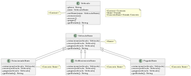
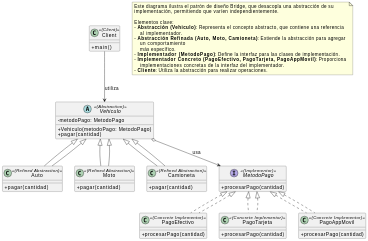
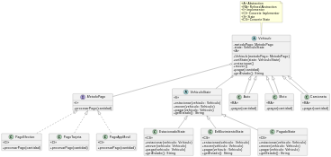

## Patrón State

El patrón State es un patrón de diseño de comportamiento que permite que un objeto cambie su comportamiento cuando su estado interno cambia. Parece como si el objeto cambiara su clase. Este patrón se utiliza para encapsular comportamientos variables para el mismo objeto basado en su estado interno.

### Cómo funciona:
- **Contexto**: Mantiene una instancia de una subclase de EstadoConcreto que define el estado actual.
- **Estado**: Define una interfaz para encapsular el comportamiento asociado con un estado particular del Contexto.
- **Estados Concretos**: Cada subclase implementa un comportamiento asociado con un estado del Contexto.

## Patrón Bridge

El patrón Bridge es un patrón de diseño estructural que desacopla una abstracción de su implementación para que las dos puedan variar independientemente. Este patrón se utiliza para separar la abstracción de su implementación, permitiendo que se desarrollen de manera independiente.

### Cómo funciona:
- **Abstracción**: Define la interfaz de la abstracción y mantiene una referencia a un objeto de tipo Implementador.
- **Abstracción Refinada**: Extiende la interfaz definida por Abstracción.
- **Implementador**: Define la interfaz para las clases de implementación.
- **Implementadores Concretos**: Implementan la interfaz del Implementador y definen implementaciones concretas.

## Patrón State

### ¿Por qué se implementó?
El patrón State se utiliza para permitir que un objeto altere su comportamiento cuando su estado interno cambia. En otras palabras, el objeto parece cambiar su clase. Este patrón es útil cuando un objeto debe cambiar su comportamiento en tiempo de ejecución dependiendo de su estado interno.

### Aplicación en tu proyecto
En tu aplicación, tienes un objeto `Vehiculo` que puede estar en diferentes estados: **Estacionado, En Movimiento y Pagado.** Dependiendo del estado en el que se encuentra el vehículo, las acciones que se pueden realizar sobre él cambian.

#### Por ejemplo:

- **EstacionadoState**: El vehículo está estacionado. Puedes moverlo o pagar por el estacionamiento.
- **EnMovimientoState**: El vehículo está en movimiento. Solo puedes estacionarlo.
- **PagadoState**: El vehículo ya ha sido pagado. No puedes realizar más acciones sobre él.

Al implementar el patrón State, encapsulas los comportamientos específicos de cada estado en clases separadas. Esto hace que el código sea más limpio, mantenible y escalable, facilitando la adición de nuevos estados o la modificación de los existentes sin afectar al resto del sistema.

## Patrón Bridge

### ¿Por qué se implementó?
El patrón Bridge (Puente) separa una abstracción de su implementación para que ambas puedan variar independientemente. Es útil cuando necesitas combinar diferentes abstracciones e implementaciones, y deseas evitar la explosión combinatoria de clases derivada de heredar cada combinación posible.

### Aplicación en tu proyecto
En tu aplicación, los `Vehiculos` (Auto, Moto, Camioneta) necesitan procesar pagos mediante diferentes métodos de pago (`MetodoPago`):

- **PagoEfectivo**
- **PagoTarjeta**
- **PagoAppMovil**

Si intentaras implementar todas las combinaciones posibles mediante herencia, tendrías que crear clases para cada combinación de vehículo y método de pago (por ejemplo, `AutoConPagoEfectivo`, `MotoConPagoTarjeta`, etc.), lo cual no es escalable.

Al utilizar el patrón Bridge, separas la jerarquía de vehículos de la jerarquía de métodos de pago:

- **Abstracción**: `Vehiculo`
    - **Abstracciones Refinadas**: `Auto`, `Moto`, `Camioneta`
- **Implementador**: `MetodoPago`
    -   **Implementadores Concretos**: `PagoEfectivo`, `PagoTarjeta`, `PagoAppMovil`

De esta forma, puedes combinar dinámicamente cualquier vehículo con cualquier método de pago sin crear clases adicionales para cada combinación.

## Integración de State y Bridge
### Diagrama de Integración

### ¿Por qué se decidió integrar ambos patrones?
La integración de **State y Bridge** en tu aplicación permite manejar de manera eficiente tanto los estados internos de los vehículos como los diferentes métodos de pago disponibles.

- **Estado del Vehículo**: Mediante el patrón **State**, controlas el flujo y las transiciones entre estados del vehículo, asegurando que las acciones (estacionar, mover, pagar) se realicen de manera coherente según el estado actual.
- **Método de Pago**: Con el patrón **Bridge**, permites que los vehículos utilicen diferentes métodos de pago sin acoplar la clase `Vehiculo` a implementaciones específicas de pago.

### Beneficios de integrar ambos patrones
1. **Flexibilidad**: Puedes agregar nuevos estados o métodos de pago sin modificar el código existente de manera significativa.
2. **Reutilización de Código**: Evitas duplicar código al no tener que crear clases para cada combinación de estado y método de pago.
3. **Mantenibilidad**: El código está organizado en clases y responsabilidades claras, lo que facilita su comprensión y mantenimiento.
4. **Escalabilidad**: Puedes ampliar el sistema agregando nuevos tipos de vehículos, estados o métodos de pago de manera sencilla.

### Ejemplo de cómo interactúan
Cuando un `Vehiculo` realiza la acción de `pagar`, este método:

1. Verifica su estado actual mediante el patrón **State** y ejecuta la lógica correspondiente.
2. Utiliza su `metodoPago` (definido por el patrón **Bridge**) para procesar el pago.
3. Cambia su estado a `PagadoState` después de completar el pago.
De esta manera, ambos patrones colaboran para ofrecer un comportamiento dinámico y flexible en el sistema.

### Conclusión
La implementación e integración de los patrones **State** y **Bridge** en tu aplicación permiten manejar la complejidad de las operaciones de estacionamiento y pago de vehículos de manera eficiente y escalable. Al separar las responsabilidades y permitir que las abstracciones y las implementaciones varíen independientemente, tu código se vuelve más robusto y adaptable a futuros cambios o expansiones en las funcionalidades del sistema.